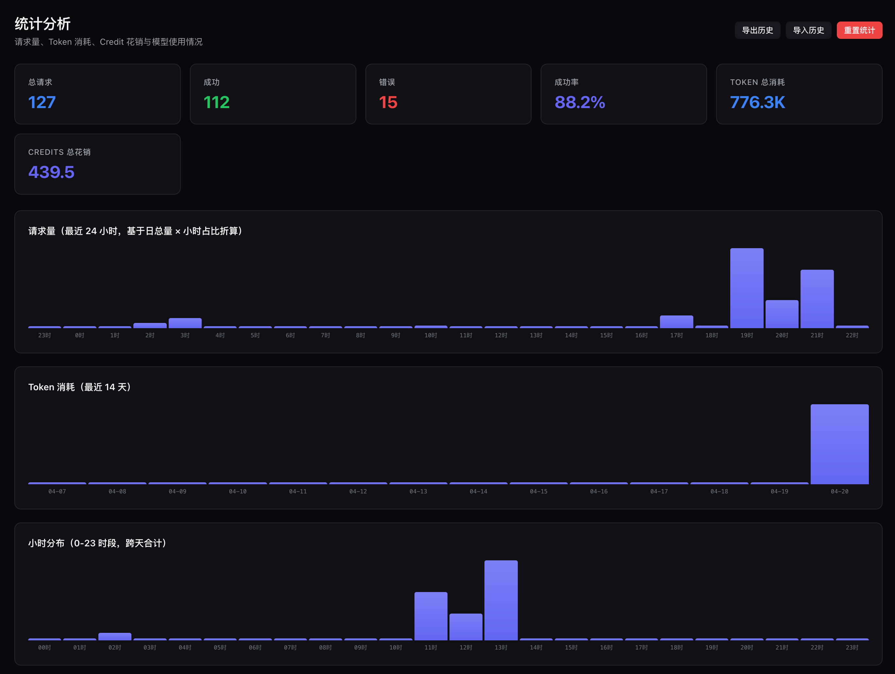

<p align="center">
  
  
  
  
  
  
</p>

<h1 align="center">WindsurfPoolAPI</h1>

<p align="center">
  <b>Proxy đa tài khoản cấp doanh nghiệp cho nền tảng AI Windsurf.</b><br/>
  Expose 113+ model (Claude / GPT / Gemini / DeepSeek / Grok / Qwen / Kimi / GLM) qua API chuẩn OpenAI và Anthropic.<br/>
  <sub>Pool nhiều tài khoản Windsurf, hỗ trợ song song hai giao thức OpenAI / Anthropic, tương thích Cursor / Claude Code.</sub>
</p>

<p align="center">
  <a href="#-bắt-đầu-nhanh">Bắt đầu nhanh</a> ·
  <a href="#-tính-năng">Tính năng</a> ·
  <a href="#-dashboard">Dashboard</a> ·
  <a href="#-tài-liệu-api">API</a> ·
  <a href="#-hướng-dẫn-triển-khai">Triển khai</a> ·
  <a href="#-câu-hỏi-thường-gặp">FAQ</a>
</p>

---

## ⚠️ Tuyên bố / Disclaimer

Dự án này chỉ phục vụ mục đích **học tập, nghiên cứu cá nhân và tự dùng (self-host)**. Mọi hành vi sử dụng thương mại, bán lại, triển khai có thu phí hoặc đóng gói thành dịch vụ cung cấp ra bên ngoài khi chưa có văn bản cho phép của tác giả đều **bị nghiêm cấm**.

---

## ✨ Tính năng

| Tính năng | Mô tả |
| :--- | :--- |
| **Hai giao thức** | `/v1/chat/completions` (OpenAI) + `/v1/messages` (Anthropic native) |
| **113+ model** | Claude Opus 4.7 · GPT-5.4 · Gemini 3.1 · DeepSeek R1 · Grok 3 · Qwen 3 · Kimi K2.5 · GLM-5.1 và nhiều hơn nữa |
| **Pool nhiều tài khoản** | Phân phối tải dựa trên dung lượng còn lại, tự động failover, giới hạn rate-limit độc lập theo từng model |
| **Phân tích token & credit** | Tổng hợp theo từng API × từng model, chi tiết đến từng request |
| **Dashboard quản trị** | SPA đầy đủ tính năng: quản lý tài khoản, cấu hình proxy, log realtime, biểu đồ sử dụng |
| **Thao tác hàng loạt** | Chọn nhiều tài khoản và bật/tắt chỉ với một cú click |
| **Đăng nhập OAuth** | Hỗ trợ Google / GitHub Firebase OAuth + làm mới token thủ công |
| **Phát hiện stall động** | Timeout dựa theo độ dài input (30s–90s), giảm cảnh báo nhầm với context lớn |
| **Trạng thái bền vững** | Mọi cài đặt, trạng thái tài khoản, token đều được lưu, restart không mất |
| **Upload ảnh** | Hỗ trợ multimodal — gửi ảnh qua block `image_url` (base64 hoặc URL) |
| **Tool calling** | Tương thích `<tool_call>` — hoạt động với Cursor, Aider và các công cụ AI coding khác |
| **Tương thích Cursor** | Hơn 80 alias tên model (gồm các tên không chứa "claude" cho Cursor) |
| **Streaming SSE** | Đúng định dạng OpenAI, hỗ trợ `stream_options.include_usage` |
| **Không có dependency** | Chỉ dùng module nội tại của Node.js, không cần `npm install` |

---

## 🚀 Bắt đầu nhanh

### Yêu cầu

- **Node.js ≥ 20**
- **Binary Windsurf Language Server** (`language_server_linux_x64` hoặc `language_server_darwin_arm64`)
- Tối thiểu một tài khoản Windsurf (gói Free hỗ trợ giới hạn model)

### Cài đặt và chạy

```bash
git clone https://github.com/guanxiaol/WindsurfPoolAPI.git
cd WindsurfPoolAPI

# Đặt binary Language Server vào /opt/windsurf/
sudo mkdir -p /opt/windsurf
sudo cp /path/to/language_server_linux_x64 /opt/windsurf/
sudo chmod +x /opt/windsurf/language_server_linux_x64

# Cấu hình tuỳ chọn
cp .env.example .env    # Sửa API_KEY, DASHBOARD_PASSWORD, ...

# Khởi động
node src/index.js
```

> **Linux** — Chạy `bash scripts/install-linux.sh` để tự tải binary và cài đặt thành dịch vụ systemd.
>
> **macOS** — Chạy `bash scripts/install-macos.sh` để tự khởi động khi đăng nhập.
>
> **Windows** — Chạy `scripts\install-windows.bat` để cài đặt theo từng bước.

Dashboard: `http://localhost:3003/dashboard`

### Docker

```bash
docker compose up -d --build
```

Mount binary Language Server vào `/opt/windsurf/` của host trước khi khởi động container.

---

## 🔑 Quản lý tài khoản

> ⚠️ **Luôn dùng phương thức đăng nhập bằng Token!**
>
> Windsurf đang có một bug đã biết: đăng nhập bằng email/password có thể khiến request bị route sang nhầm tài khoản.
>
> **Lấy token tại**: [https://windsurf.com/editor/show-auth-token?workflow=](https://windsurf.com/editor/show-auth-token?workflow=)

```bash
# Thêm tài khoản qua Token (khuyến nghị)
curl -X POST http://localhost:3003/auth/login \
  -H "Content-Type: application/json" \
  -d '{"token": "your-windsurf-token"}'

# Thêm hàng loạt
curl -X POST http://localhost:3003/auth/login \
  -H "Content-Type: application/json" \
  -d '{"accounts": [{"token": "t1"}, {"token": "t2"}]}'

# Liệt kê tài khoản
curl http://localhost:3003/auth/accounts

# Xoá tài khoản
curl -X DELETE http://localhost:3003/auth/accounts/{id}
```

---

## 📡 Tài liệu API

### Tương thích OpenAI

```bash
curl http://localhost:3003/v1/chat/completions \
  -H "Content-Type: application/json" \
  -H "Authorization: Bearer sk-your-api-key" \
  -d '{
    "model": "gpt-4o-mini",
    "messages": [{"role": "user", "content": "Xin chào!"}],
    "stream": false
  }'
```

### Tương thích Anthropic

```bash
curl http://localhost:3003/v1/messages \
  -H "Content-Type: application/json" \
  -H "anthropic-version: 2023-06-01" \
  -H "x-api-key: sk-your-api-key" \
  -d '{
    "model": "claude-sonnet-4.6",
    "max_tokens": 1024,
    "messages": [{"role": "user", "content": "Xin chào!"}]
  }'
```

### Biến môi trường

| Biến | Mặc định | Mô tả |
| :--- | :--- | :--- |
| `PORT` | `3003` | Cổng HTTP server |
| `API_KEY` | _(rỗng)_ | Key xác thực cho `/v1/*`. Để rỗng = mở công khai |
| `DASHBOARD_PASSWORD` | _(rỗng)_ | Mật khẩu admin của dashboard |
| `DEFAULT_MODEL` | `claude-4.5-sonnet-thinking` | Model mặc định khi request không chỉ định |
| `MAX_TOKENS` | `8192` | Số token output tối đa mặc định |
| `LOG_LEVEL` | `info` | `debug` / `info` / `warn` / `error` |
| `LS_BINARY_PATH` | `/opt/windsurf/language_server_linux_x64` | Đường dẫn Language Server |
| `LS_PORT` | `42100` | Cổng gRPC của Language Server |
| `BYPASS_ENTITLEMENT` | _(rỗng)_ | Đặt `1` để bỏ qua kiểm tra tier — proxy sẽ thử forward tới Windsurf upstream cho mọi model. Hữu ích để debug |

### Dashboard API

Tất cả endpoint đều yêu cầu header `X-Dashboard-Password`.

| Method | Đường dẫn | Mô tả |
| :--- | :--- | :--- |
| `GET` | `/dashboard/api/overview` | Tổng quan hệ thống |
| `GET` | `/dashboard/api/accounts` | Liệt kê toàn bộ tài khoản |
| `POST` | `/dashboard/api/accounts/batch-status` | Bật/tắt hàng loạt tài khoản |
| `POST` | `/dashboard/api/oauth-login` | Đăng nhập OAuth (Google/GitHub) |
| `POST` | `/dashboard/api/accounts/:id/refresh-token` | Làm mới token Firebase |
| `POST` | `/dashboard/api/accounts/:id/rate-limit` | Kiểm tra dung lượng tài khoản |
| `GET` | `/dashboard/api/usage` | Toàn bộ thống kê sử dụng |
| `GET` | `/dashboard/api/usage/export` | Xuất thống kê dạng JSON |
| `POST` | `/dashboard/api/usage/import` | Nhập thống kê (tự dedup) |
| `GET` | `/dashboard/api/logs/stream` | Stream log realtime qua SSE |

---

## 🖥 Dashboard

Truy cập tại `http://localhost:3003/dashboard`

| Panel | Mô tả |
| :--- | :--- |
| **Tổng quan** | Số liệu runtime, tình trạng pool, tỉ lệ thành công |
| **Đăng nhập** | Đăng nhập Windsurf bằng token/email, OAuth |
| **Tài khoản** | Thêm/xoá, bật/tắt hàng loạt, proxy theo tài khoản, hiển thị quota |
| **Model** | Allow/blocklist toàn cục, hạn chế model theo tài khoản |
| **Proxy** | Proxy HTTP/SOCKS5 toàn cục và theo tài khoản |
| **Log** | Stream log realtime qua SSE, lọc theo level |
| **Phân tích** | Biểu đồ token/credit, xu hướng 14 ngày, phân bố 24h, chi tiết request |
| **Phát hiện** | Theo dõi pattern lỗi, sức khoẻ tài khoản |
| **Thử nghiệm** | Tái sử dụng cascade session, ẩn danh tính model, preflight rate-limit |

### Ảnh chụp giao diện

<p align="center">
  <b>Pool tài khoản — Theo dõi quota nhiều tài khoản</b><br/>
  
</p>

<p align="center">
  <b>Phân tích — Biểu đồ sử dụng Token & Credit</b><br/>
  
</p>

<p align="center">
  <b>Thống kê model — Phân tích theo từng model</b><br/>
  
</p>

---

## 🤖 Các model được hỗ trợ

<details>
<summary><b>Claude (Anthropic)</b></summary>

`claude-3.5-sonnet` · `claude-3.7-sonnet[-thinking]` · `claude-4-sonnet[-thinking]` · `claude-4-opus[-thinking]` ·
`claude-4.1-opus[-thinking]` · `claude-4.5-sonnet[-thinking]` · `claude-4.5-haiku` · `claude-4.5-opus[-thinking]` ·
`claude-sonnet-4.6[-thinking][-1m]` · `claude-opus-4.6[-thinking]` · `claude-opus-4.7-{low,medium,high,xhigh,max}`

</details>

<details>
<summary><b>GPT (OpenAI)</b></summary>

`gpt-4o` · `gpt-4o-mini` · `gpt-4.1[-mini/nano]` · `gpt-5[-mini]` · `gpt-5.2[-low/medium/high]` ·
`gpt-5.4[-low/medium/high/xhigh]` · `gpt-5.3-codex` · `o3[-mini/high/pro]` · `o4-mini`

</details>

<details>
<summary><b>Gemini (Google)</b></summary>

`gemini-2.5-pro` · `gemini-2.5-flash` · `gemini-3.0-pro` · `gemini-3.0-flash` · `gemini-3.1-pro[-low/high]`

</details>

<details>
<summary><b>Khác</b></summary>

`deepseek-v3` · `deepseek-r1` · `grok-3[-mini]` · `grok-code-fast-1` · `qwen-3` · `qwen-3-coder` ·
`kimi-k2` · `kimi-k2.5` · `swe-1.5[-thinking]` · `swe-1.6-fast` · `arena-fast` · `arena-smart`

</details>

> Catalog model được tự động đồng bộ từ Windsurf cloud khi khởi động. Tài khoản Free chỉ dùng được `gpt-4o-mini` và `gemini-2.5-flash`.

---

## 🚢 Hướng dẫn triển khai

### PM2 (khuyến nghị)

```bash
npm install -g pm2
pm2 start src/index.js --name windsurfpool --cwd /path/to/WindsurfPoolAPI
pm2 save && pm2 startup
```

### systemd (Linux)

```ini
# /etc/systemd/system/windsurfpool.service
[Unit]
Description=WindsurfPoolAPI
After=network.target

[Service]
Type=simple
User=windsurf
WorkingDirectory=/opt/WindsurfPoolAPI
ExecStart=/usr/bin/node src/index.js
Restart=on-failure
RestartSec=5
Environment=PORT=3003

[Install]
WantedBy=multi-user.target
```

```bash
sudo systemctl enable --now windsurfpool
```

### macOS (launchd)

```bash
bash scripts/install-macos.sh
```

### Tường lửa

```bash
# Ubuntu
sudo ufw allow 3003/tcp

# CentOS
sudo firewall-cmd --add-port=3003/tcp --permanent && sudo firewall-cmd --reload
```

> Với cloud server, nhớ mở port 3003 trong security group.

---

## 🏗 Kiến trúc

```text
Client (OpenAI SDK / Anthropic SDK / curl / Cursor / Aider)
   │
   ▼
WindsurfPoolAPI  (Node.js HTTP, :3003)
   ├── /v1/chat/completions    (định dạng OpenAI)
   ├── /v1/messages            (định dạng Anthropic)
   ├── /dashboard/api/*        (Admin API)
   └── /dashboard              (Admin SPA)
   │
   ▼
Pool Language Server  (gRPC trên HTTP/2, :42100+)
   │
   ▼
Windsurf Cloud  (server.self-serve.windsurf.com)
```

Xem `ARCHITECTURE.md` để biết chi tiết từng module.

---

## ❓ Câu hỏi thường gặp

**Q: Khởi động báo `LS binary not found`?**
A: Đảm bảo binary tồn tại tại `/opt/windsurf/language_server_linux_x64` (hoặc đặt biến `LS_BINARY_PATH`).

**Q: Báo `No accounts available`?**
A: Thêm ít nhất một tài khoản qua Dashboard hoặc `POST /auth/login`.

**Q: Mọi tài khoản đều trả `permission_denied`?**
A: Tài khoản Free chỉ hỗ trợ `gpt-4o-mini` và `gemini-2.5-flash`. Các model khác cần Windsurf Pro.

**Q: Làm sao migrate thống kê giữa các server?**
A: Xuất: `GET /dashboard/api/usage/export` → Nhập: `POST /dashboard/api/usage/import` (tự dedup).

**Q: Cập nhật danh sách model thế nào?**
A: Model tự đồng bộ khi khởi động. Restart service để làm mới.

**Q: Cờ `BYPASS_ENTITLEMENT=1` để làm gì?**
A: Bỏ qua kiểm tra entitlement theo tier ở phía proxy — request sẽ được forward tới Windsurf bất kể model nào. Hữu ích để kiểm tra/debug khi tier hiển thị sai. Lỗi entitlement thật vẫn sẽ bị Windsurf upstream từ chối.

---

## 🤝 Đóng góp

Xem `CONTRIBUTING.md`. Hoan nghênh issue và PR.

---

## 🙏 Lời cảm ơn

Dự án được xây dựng dựa trên [dwgx/WindsurfAPI](https://github.com/dwgx/WindsurfAPI). Đặc biệt cảm ơn [@dwgx](https://github.com/dwgx) vì những đóng góp nền tảng và tinh thần mã nguồn mở.

---

## 📄 Giấy phép

[MIT](LICENSE)
